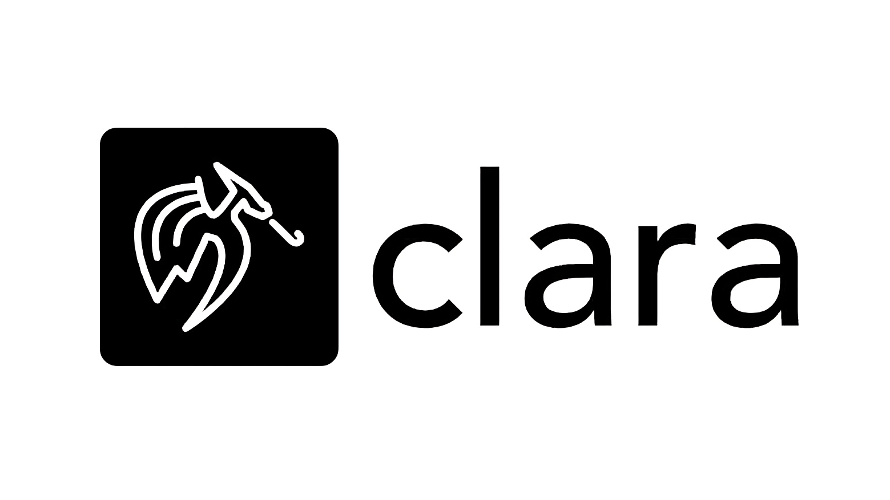

# Clara : Cybersecurity based LLM for Anomaly and Risk Assessor  



## What is Clara
Clara is your AI-powered security partner, designed to make finding vulnerabilities in your code easier and faster. It's a Large Language Model (LLM) that we've carefully post-trained, using a refined version of the PrimeVul dataset, to become an expert in spotting potential security weaknesses. This specialized training means Clara can understand your code in a way that traditional tools often can't, helping you build more secure software.

## Our Goal
Our goal is to find a unique approach to solve the challenges of software vulnerability detection. Traditional methods often fall short, struggling with complex code and evolving threats. We aim to leverage the power of Large Language Models (LLMs) to create a system that can identify vulnerabilities that are typically missed by conventional tools.

## Checkout our model and dataset on huggingface
- [clara-v0.1](https://huggingface.co/ussooraj/clara-v0.1-4bit-gguf)
- [PrimeVul](https://huggingface.co/datasets/ussooraj/PrimeVul) modified specifically for LLM finetuning 

## Key Features:
* **Privacy-Preserving Operation**: The entire system runs locally, ensuring your code and data never leave your machine. No external servers or cloud services are involved.

* **Lightweight and Accessible**: Designed with efficiency in mind, using lightweight Large Language Models (LLMs) to ensure compatibility with a wide range of systems, including those with limited resources.

* **Temporal Retrieval-Augmented Generation (T-RAG)**: Integrates a T-RAG system using an Exploit Database, providing accurate analysis of time-sensitive vulnerabilities and keeping you informed about the latest threats.

* **Intuitive Web Interface**: Offers a clean and user-friendly web UI, making vulnerability analysis accessible to users of all technical levels.

## Prerequisites:

1. **Ollama**: Installation of Ollama is required to run the Large Language Model. Instructions can be found on the official Ollama website.

2. **Clara LLM Model**: Download the Clara LLM model from our Hugging Face repository: ([Huggingface](https://huggingface.co/ussooraj/clara-v0.1-4bit-gguf)).


## Initial Setup:

### On Mac OS and linux:

1. install ollama and make sure its running by opening a browser and goto `http://127.0.0.1:11434`
and its should display a message: `ollama is running`

2. then execute this command `sudo systemctl stop ollama.service && OLLAMA_ORIGINS=* ollama serve`
which creates a new instance of ollama, if you want you could again check if its working by following step 1

### For Windows:

1. just `ollama serve`

## Installation:

### Creating a modelfile

now create a modelfile using any text editor 

first specify the LLM model location in the computer
`FROM /path/to/clara.gguf`

it uses the same template of LLAMA 3.1 which is used as the base model, so you could use the same template:

```
TEMPLATE """
{{ if .System }}<|start_header_id|>system<|end_header_id|>

{{ .System }}<|eot_id|>{{ end }}{{ if .Prompt }}<|start_header_id|>user<|end_header_id|>

{{ .Prompt }}<|eot_id|>{{ end }}<|start_header_id|>assistant<|end_header_id|>

{{ .Response }}<|eot_id|>
"""
```
now specify the stop parameters:
```
PARAMETER stop "<|start_header_id|>"
PARAMETER stop "<|end_header_id|>"
PARAMETER stop "<|eot_id|>"
```

if you want you could set the system prompt
```
SYSTEM """
put your system prompt here
"""
```
thats it :)
now save the file

### Creating an ollama model:

if you did all the steps correctly you can proceed to creating a Ollama model

- open terminal and go to the location of the modelfile
`cd /path/to/modelfile`

- then create the model from gguf using modelfile
`ollama create <name_of_the_model> -f <name_of_the_modelfile>`

- now check if the model is created or not:
`ollama list`
it should give an output displaying the name that youre given to your model

- and finally to check if it works run:
`ollama run <name_of_the_model>`
you could exit by `Ctrl+D` or `/bye`

## To start WebUI

- **Clone the repository**: `https://github.com/ussooraj/Clara.git`
- **Run index.html**: just open any web browser specifing the path of index.html file `firefox index.html`

## Acknowledgements

This project builds upon several important contributions to the field.

We used [Ollama](https://github.com/ollama/ollama) for model deployment, benefiting from its efficient CPU and GPU inference capabilities.

Our Large Language Model is based on [LLAMA 3.1](https://huggingface.co/meta-llama/Llama-3.1-8B), and its vulnerability detection capabilities were enhanced through fine-tuning with the [PrimeVul](https://github.com/DLVulDet/PrimeVul) dataset.

We are grateful for the availability of these resources.


## License

Clara is an open source software licensed under the MIT License. See the [LICENSE](LICENSE) file for more details.

[license]: ./LICENSE